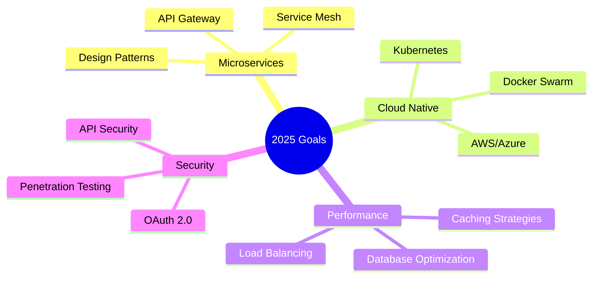

# 👋 **FAZEL ZARE**
### **Backend Developer | Django & DRF Specialist**

<div align="center">
  
[](https://www.linkedin.com/in/fazelzareme)
[](https://github.com/init050)
[](https://t.me/init050)
[](mailto:Fazelzare@proton.me)

</div>

---

## 🚀 **Tech Stack**

<div align="center">

### **Programming Languages**


### **Backend Frameworks**


### **Databases & Caching**


### **DevOps & Development**


### **Protocols & Frontend**


</div>

---

## 💼 **Professional Skills**

<table align="center">
<tr>
<td align="center" width="33%">

### 🔧 **Technical**
**Backend Development**  
**API Design & REST**  
**Database Architecture**  
**Real-time Systems**  
**Testing & QA**  
**Performance Optimization**

</td>
<td align="center" width="33%">

### 🏗️ **Architecture**
**Microservices Design**  
**Scalable Systems**  
**Caching Strategies**  
**Message Queues**  
**WebSocket Implementation**  
**Security Best Practices**

</td>
<td align="center" width="33%">

### 👥 **Soft Skills**
**Project Management**  
**Team Leadership**  
**Agile Methodologies**  
**Problem Solving**  
**Technical Documentation**  
**Collaborative Development**

</td>
</tr>
</table>

---

## 🎯 **Current Focus**

<div align="center">



</div>

---

## 🛠️ **Core Competencies**

<div align="center">

| **Backend** | **Database** | **DevOps** | **Tools** |
|:---:|:---:|:---:|:---:|
| Django | PostgreSQL | Docker | Git |
| Django REST | Redis | CI/CD | Celery |
| WebSocket | Query Optimization | Unit Testing | API Testing |
| RESTful APIs | Database Design | Containerization | Version Control |

</div>

---

## 📊 **Development Philosophy**

<div align="center">

```
🎯 Clean Code → 🔧 Test-Driven → 📈 Scalable → 🚀 Performant
```

### **Key Principles**
**• Write maintainable and documented code**  
**• Design with scalability in mind**  
**• Implement comprehensive testing**  
**• Optimize for performance**  
**• Follow security best practices**

</div>

---

## 🌟 **What I Bring to the Table**

- 🏗️ **Architecture Design**: Building scalable and maintainable backend systems
- 🔌 **API Development**: Creating robust RESTful APIs with Django REST Framework
- 📊 **Database Expertise**: Designing efficient database schemas and optimization
- 🚀 **Performance**: Implementing caching strategies and query optimization
- 🔄 **Real-time Features**: WebSocket integration for live functionality
- 🐳 **DevOps**: Containerization and CI/CD pipeline implementation
- 👥 **Leadership**: Leading development teams and managing projects

---

## 📬 **Let's Connect**

<div align="center">

I'm always interested in discussing new opportunities, challenging projects, and innovative solutions.

**📧 Email**: [Fazelzare@proton.me](mailto:Fazelzare@proton.me)  
**💼 LinkedIn**: [/in/fazelzareme](https://www.linkedin.com/in/fazelzareme)  
**🐙 GitHub**: [init050](https://github.com/init050)  
**✈️ Telegram**: [@init050](https://t.me/init050)

</div>

---

<div align="center">
  
### **"Building robust backends, one API at a time"**

</div>
