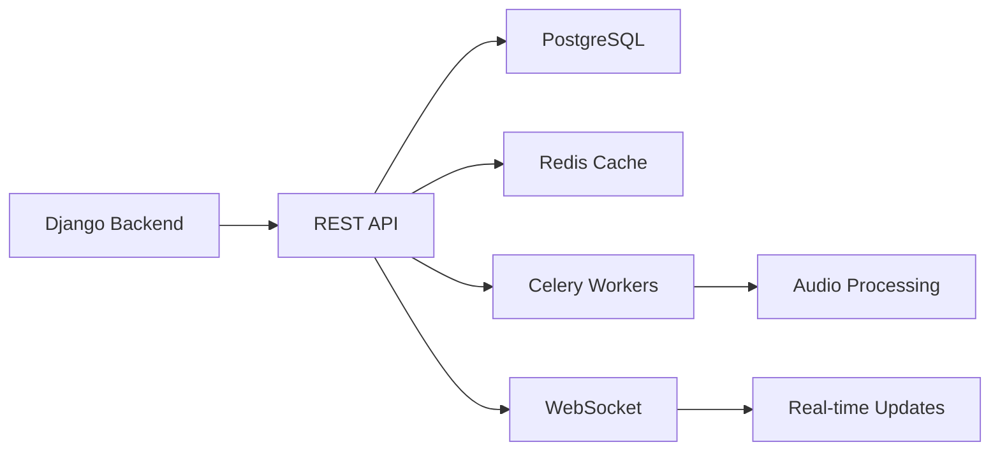
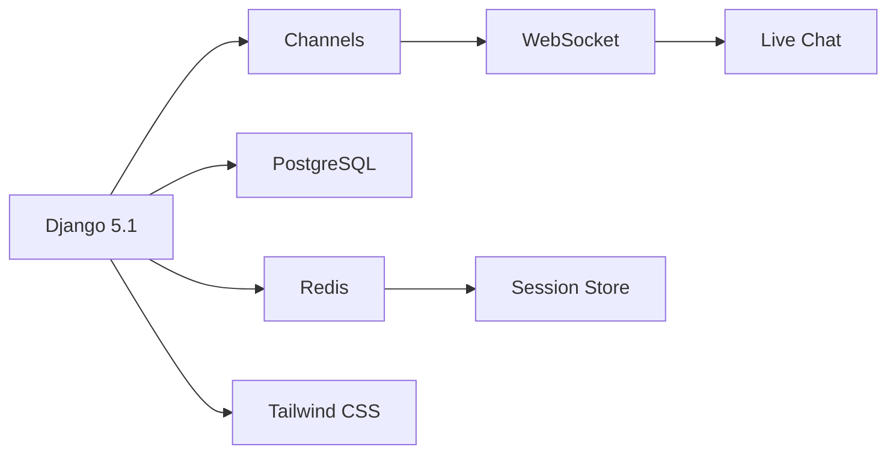
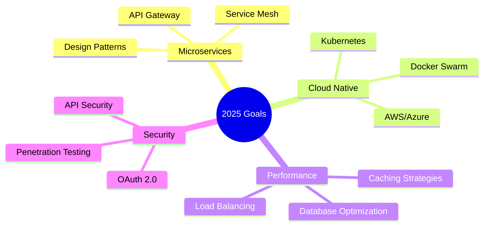

<div align="center">
  
</div>

<div align="center">
  <a href="https://git.io/typing-svg">
    
  </a>
</div>

<br>

<div align="center">
  
</div>

<br>

##  **About Me**


```python
class BackendArchitect:
    def __init__(self):
        self.name = "Fazel Zare"
        self.role = "Senior Backend Developer"
        self.location = "Tehran, Iran 🇮🇷"
        self.company = "Previously @ Payavardasa"
        self.languages = ["English", "Persian"]
        
    def say_hello(self):
        print("Thanks for visiting my profile!")
        print("Let's build something amazing together 🚀")
        
    def my_stack(self):
        return {
            "backend": ["Django", "DRF", "FastAPI"],
            "database": ["PostgreSQL", "Redis", "MongoDB"],
            "devops": ["Docker", "CI/CD", "AWS"],
            "realtime": ["WebSockets", "Django Channels"],
            "currently_learning": ["Microservices", "Kubernetes"]
        }

me = BackendArchitect()
me.say_hello()
```

<br clear="right">

##  **Tech Arsenal**

<div align="center">

### ⚡ Core Technologies
<div>
  
</div>

### 🛠️ Full Stack & Tools
<div>
  
</div>

### ☁️ DevOps & Cloud
<div>
  
</div>

</div>

<br>

<div align="center">
  
</div>

<br>

## 🎯 **Expertise Breakdown**

<div align="center">

| 🎨 **Category** | 🛠️ **Technologies** | 📊 **Proficiency** |
|:---:|:---|:---:|
| **Backend** | Django, Django REST Framework, FastAPI | █████████░ 90% |
| **Databases** | PostgreSQL, Redis, MongoDB | ████████░░ 80% |
| **DevOps** | Docker, CI/CD, Git, Linux | ████████░░ 80% |
| **Real-time** | WebSockets, Django Channels, Celery | █████████░ 90% |
| **Testing** | Unit Testing, TDD, Pytest | ███████░░░ 70% |
| **Frontend** | JavaScript, Tailwind CSS | ██████░░░░ 60% |

</div>

<br>

## 🚀 **Featured Projects**

<div align="center">
  <a href="https://github.com/init050/spotify-clone">
    
  </a>
  <a href="https://github.com/init050/plant-shop">
    
  </a>
</div>

### 🎵 **Spotify Clone** - Full Music Streaming Platform
<div align="left">
  


**Key Features:**
- 🔐 JWT Authentication with 2FA
- 🎵 High-quality audio streaming with adaptive bitrate
- 📊 Real-time analytics dashboard
- 🎧 Smart playlist generation
- 👥 Social features & collaborative playlists
- ⚡ Async audio processing with Celery

</div>

---

### 🌿 **Plant Shop** - Modern E-Commerce Platform
<div align="left">



**Key Features:**
- 🛒 Full e-commerce functionality
- 💬 Real-time customer support chat
- 📱 Responsive design with Tailwind CSS
- 🔍 Advanced search & filtering
- 📊 Admin analytics dashboard
- 🚀 ASGI deployment with Daphne

</div>

<br>

## 💼 **Professional Journey**


### 🏢 **Python Developer @ Payavardasa**
`January 2023 - September 2024 | Tehran, Iran`

```javascript
const achievements = [
  "🔄 Automated 50+ manual processes",
  "📊 Built data pipeline processing 1M+ records daily",
  "⚡ Reduced data processing time by 70%",
  "🛠️ Developed 20+ custom automation tools",
  "📈 Improved system efficiency by 3x"
];

achievements.forEach(achievement => {
  console.log(achievement);
});
```

<br clear="right">

## 📊 **GitHub Analytics**

<div align="center">
  
  
</div>

<div align="center">
  
</div>

<br>

## 🏆 **Achievements & Certifications**

<div align="center">

| 🎖️ **Achievement** | 📅 **Date** | 🏢 **Issuer** |
|:---|:---:|:---:|
| 🥇 Backend Development Excellence | 2024 | Payavardasa |
| 📜 Django Advanced Certification | 2023 | Online Course |
| 🏅 Best Automation Solution | 2023 | Internal Award |
| 🎯 Problem Solver of the Year | 2023 | Team Recognition |

</div>

<br>

## 🎯 **Current Focus**

<div align="center">



</div>

<br>

## 🤝 **Let's Connect**

<div align="center">
  
  <a href="https://github.com/init050">
    
  </a>
  <a href="https://linkedin.com/in/fazel-zare">
    
  </a>
  <a href="mailto:Fazelzare@proton.me">
    
  </a>
  <a href="https://t.me/fazeljoon">
    
  </a>

  <br><br>
  
  
  
  <br><br>
  
  
  
</div>

<br>

<div align="center">
  
</div>

---

<div align="center">
  <b>⚡ "Building the backend infrastructure that powers tomorrow's applications" ⚡</b>
  
  <br><br>
  
  
</div>
