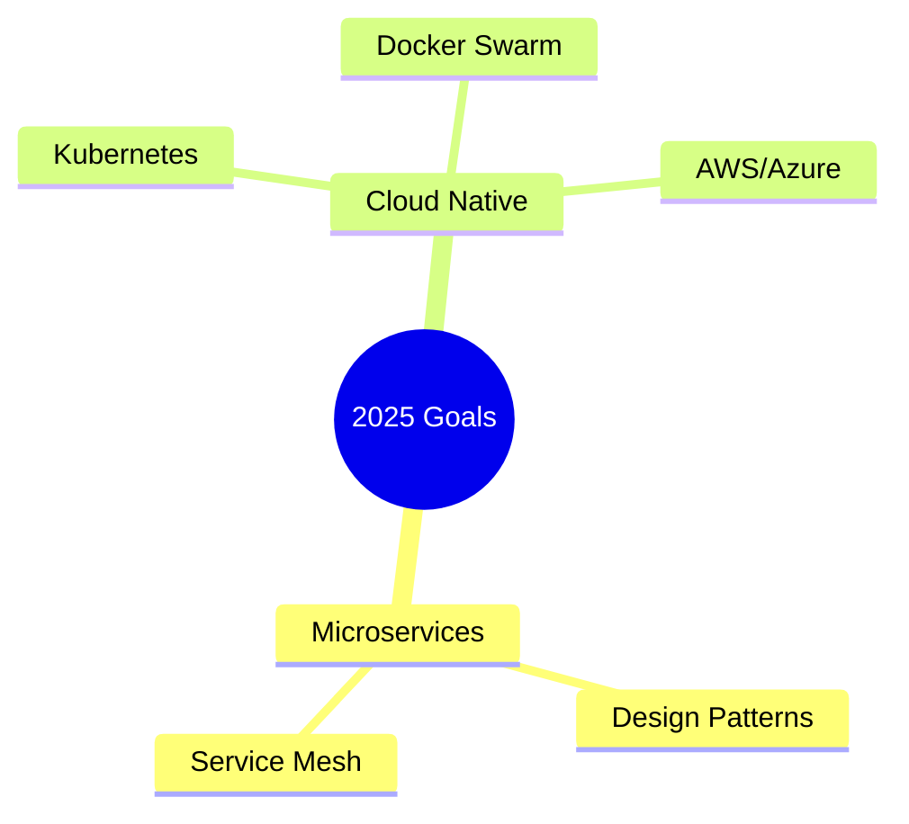

#  **FAZEL ZARE**
### **✨ Backend Developer | Django & DRF Specialist**

  

  

## 🚀 **Tech Stack**

### **💻 Programming Languages**

  
  

### **⚙️ Backend Frameworks**

  
  

### **🗄️ Databases & Caching**

  
  

### **🔧 DevOps & Development**

  
  
  
  

### **🌐 Protocols & Frontend**

  
  

## 🎯 **Current Focus**

## 📊 **Development Philosophy**

<table>
  <tr>
    <td align="center">🎯 <b>Clean Code</b></td>
    <td align="center">→</td>
    <td align="center">🔧 <b>Test-Driven</b></td>
    <td align="center">→</td>
    <td align="center">📈 <b>Scalable</b></td>
    <td align="center">→</td>
    <td align="center">🚀 <b>Performant</b></td>
  </tr>
</table>

### **✨ Key Principles**

| Principle | Description |
|-----------|-------------|
| 📝 **Maintainable Code** | Write maintainable and documented code |
| 🏗️ **Scalable Design** | Design with scalability in mind |
| ✅ **Comprehensive Testing** | Implement comprehensive testing |
| ⚡ **Performance First** | Optimize for performance |
| 🔒 **Security Best Practices** | Follow security best practices |

  
###  **"Building robust backends, one API at a time"**

 

